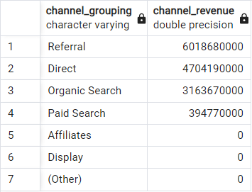

# Starting with Data
---


## Question 1
> What is the total transaction revenue for each possible channel grouping?

```sql
SELECT
	channel_grouping,
	SUM(
		CASE
			WHEN total_transaction_revenue IS NULL THEN 0
			ELSE total_transaction_revenue
		END
	) AS channel_revenue
FROM all_sessions
GROUP BY channel_grouping
ORDER BY channel_revenue DESC
```

### Answer



